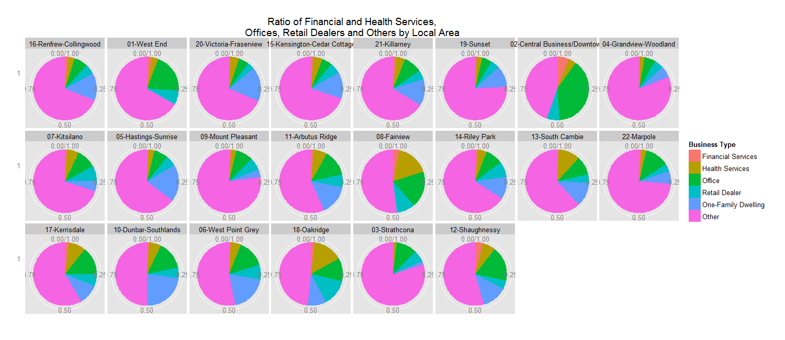
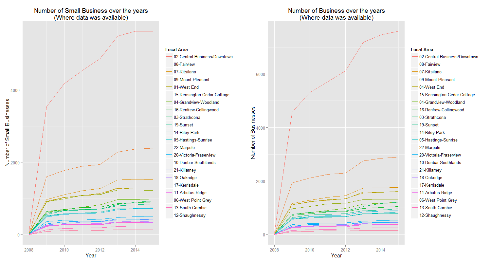
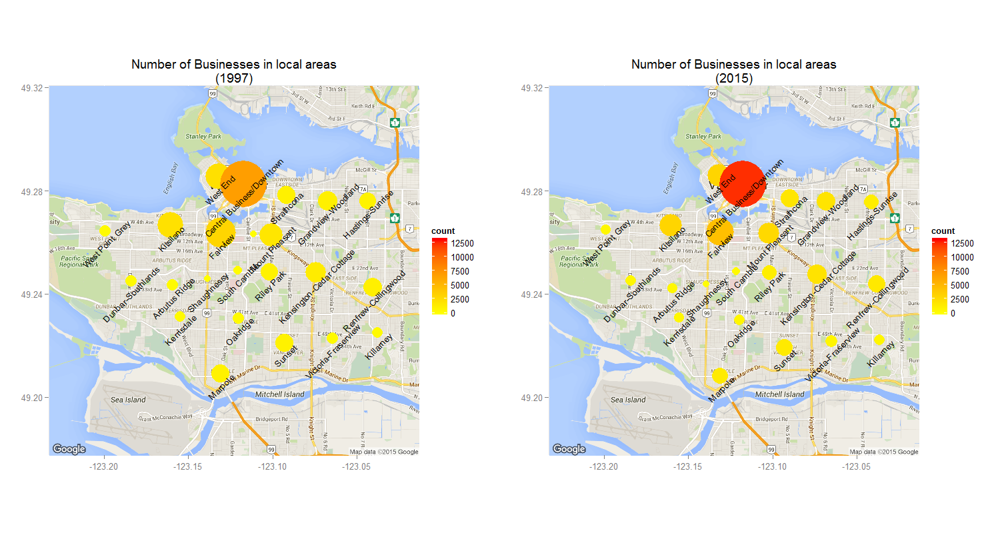

```{r multiplot, echo=FALSE}
multiplot <- function(..., plotlist=NULL, file, cols=1, layout=NULL) {
        library(grid)
        
        # Make a list from the ... arguments and plotlist
        plots <- c(list(...), plotlist)
        
        numPlots = length(plots)
        
        # If layout is NULL, then use 'cols' to determine layout
        if (is.null(layout)) {
                # Make the panel
                # ncol: Number of columns of plots
                # nrow: Number of rows needed, calculated from # of cols
                layout <- matrix(seq(1, cols * ceiling(numPlots/cols)),
                                 ncol = cols, nrow = ceiling(numPlots/cols))
        }
        
        if (numPlots==1) {
                print(plots[[1]])
                
        } else {
                # Set up the page
                grid.newpage()
                pushViewport(viewport(layout = grid.layout(nrow(layout), ncol(layout))))
                
                # Make each plot, in the correct location
                for (i in 1:numPlots) {
                        # Get the i,j matrix positions of the regions that contain this subplot
                        matchidx <- as.data.frame(which(layout == i, arr.ind = TRUE))
                        
                        print(plots[[i]], vp = viewport(layout.pos.row = matchidx$row,
                                                        layout.pos.col = matchidx$col))
                }
        }
}
```
#*Businesses of Vancouver by Malna Polya*
##Objective  
  
The objective of this document is to analyze the dataset about businesses in Vancouver over the years of 1997-2015 and to find interesting stories related to these businesses. The original dataset can be found [here](http://data.vancouver.ca/datacatalogue/businessLicence.htm).

##Preparation
###Reading the data and initial transformation  
There is a separate dataset for each year that we read in, noting that "000" and "" are the two NA characters. After reading the datasets, we add the respective years to a new year column and append the datasets creating a new *data* data frame. We also create two new variables that contain the Issued and Experied dates as *dates*.

```{r read,warning=FALSE,message=FALSE,cache=TRUE}
data97<-read.csv('1997business_licences.csv',na.strings = c("","000"))
data98<-read.csv('1998business_licences.csv',na.strings = c("","000"))
data99<-read.csv('1999business_licences.csv',na.strings = c("","000"))
data00<-read.csv('2000business_licences.csv',na.strings = c("","000"))
data01<-read.csv('2001business_licences.csv',na.strings = c("","000"))
data02<-read.csv('2002business_licences.csv',na.strings = c("","000"))
data03<-read.csv('2003business_licences.csv',na.strings = c("","000"))
data04<-read.csv('2004business_licences.csv',na.strings = c("","000"))
data05<-read.csv('2005business_licences.csv',na.strings = c("","000"))
data06<-read.csv('2006business_licences.csv',na.strings = c("","000"))
data07<-read.csv('2007business_licences.csv',na.strings = c("","000"))
data08<-read.csv('2008business_licences.csv',na.strings = c("","000"))
data09<-read.csv('2009business_licences.csv',na.strings = c("","000"))
data10<-read.csv('2010business_licences.csv',na.strings = c("","000"))
data11<-read.csv('2011business_licences.csv',na.strings = c("","000"))
data12<-read.csv('2012business_licences.csv',na.strings = c("","000"))
data13<-read.csv('2013business_licences.csv',na.strings = c("","000"))
data14<-read.csv('2014business_licences.csv',na.strings = c("","000"))
data15<-read.csv('business_licences.csv',na.strings = c("","000"))
library(plyr)
library(dplyr)
data97$Year<-1997
data98$Year<-1998
data99$Year<-1999
data00$Year<-2000
data01$Year<-2001
data02$Year<-2002
data03$Year<-2003
data04$Year<-2004
data05$Year<-2005
data06$Year<-2006
data07$Year<-2007
data08$Year<-2008
data09$Year<-2009
data10$Year<-2010
data11$Year<-2011
data12$Year<-2012
data13$Year<-2013
data14$Year<-2014
data15$Year<-2015
data<-bind_rows(data97,data98,data99,data00,data01,data02,data03,data04,data05,data06,data07,data08,data09,data10,data11,data12,data13,data14,data15)
data$IssuedDate2<-as.Date(data$IssuedDate,"%Y-%m-%d %H:%M:%S")
data$ExpiredDate2<-as.Date(data$ExpiredDate,"%Y-%m-%d %H:%M:%S")
```

##Analysis

###Examining closed business data 
We subset the dataset, only including the data with closed businesses (Gone out of Business or Cancelled Status of certificate). The new dataset is called *ClosedBusinessData*.
*AverageInBusiness* shows the calculated years of operations of those businesses that are closed and *ClosedBusinessData2* contains information about the closed businesses, their whereabouts and their years of operaions.

```{r ClosedBusiness, echo=FALSE,warning=FALSE,message=FALSE,cache=TRUE}
ClosedBusinessName<-unique(select(filter(data,(Status %in% c("Cancelled","Gone Out of Business"))),BusinessName))
ClosedBusinessData<-(data  %>%  filter(is.na(BusinessName)!=TRUE) %>% filter(BusinessName %in% ClosedBusinessName$BusinessName)) 
AverageInBusiness<-(ClosedBusinessData %>% group_by(BusinessName) %>%  summarise(LengthOfBusiness=(max(ExpiredDate2,na.rm=TRUE)-min(IssuedDate2,na.rm=TRUE)))%>% filter(LengthOfBusiness>0 & LengthOfBusiness<20*365))
ClosedBusinessData2<-unique(select(filter(data,(Status %in% c("Cancelled","Gone Out of Business"))),c(BusinessName, BusinessType, BusinessSubType,City,PostalCode,LocalArea)))
ClosedBusinessData2<-inner_join(ClosedBusinessData2,AverageInBusiness,by="BusinessName")
```

By examining the average years of operation by local area, one can see that there are some slight differences between the individual areas. The area with the shortest average time of operation is Renfrew-Collingwood, averaging 4.5 years, while the area with the longest average time of operation is Shaughnessy, averaging 5.9 years.

```{r ClosedByArea, warning=FALSE,message=FALSE,cache=TRUE}
        #ordering the factors for better plotting outcomes
ClosedBusinessData2$orderedLocalArea<-reorder(factor(ClosedBusinessData2$LocalArea),ClosedBusinessData2$LengthOfBusiness,mean)
        #showing only those rows where the area is not empty
ClosedByArea <- (ClosedBusinessData2 %>% filter(is.na(orderedLocalArea)!=TRUE) %>% group_by(orderedLocalArea) %>% summarise(average=mean(LengthOfBusiness)))
        #calculating the average years of operations
ClosedByArea$averageyear<-as.integer(ClosedByArea$average)/365
        #the area with the lowest average years of operation
ClosedByArea$orderedLocalArea[ClosedByArea$averageyear==min(ClosedByArea$averageyear)]
min(ClosedByArea$averageyear)
        #the area with the highest average years of operation
ClosedByArea$orderedLocalArea[ClosedByArea$averageyear==max(ClosedByArea$averageyear)]
max(ClosedByArea$averageyear)
library(ggplot2)
        #plotting the outcome
p<-ggplot(ClosedBusinessData2[is.na(ClosedBusinessData2$LocalArea)!=TRUE,],aes(x=orderedLocalArea,as.integer(LengthOfBusiness)/365))
p+geom_boxplot(aes(fill=orderedLocalArea))+scale_fill_discrete(name="Local Area")+ggtitle("Average years of operations by Local Area")+xlab("Local Area (See legend)")+ylab("Average Years of Operation")+scale_x_discrete(breaks=NULL)
```


###Type of businesses by area

As a qualitative analysis, we examine the proportion of the most popular currently open business types in the different local areas (see below). It is apparent that the areas with on average longer years of operation (the length of operation increases going from left to right, from top to bottom) have more of the most popular business types, and less from the "Other" businesses. One of the reasons for the shorter length of operation can be the the less profitable or more seasonal nature of those less popular business types. This requires further quantitative analysis.

```{r Type by area, warning=FALSE,message=FALSE,cache=TRUE}
        #only showing open businesses, in 2015
RecentBus<-data %>% filter(Status=="Issued") %>% filter(!is.na(BusinessType)) %>% filter(!is.na(LocalArea)) %>%filter(Year==2015)
        #those businesses with not the popular business types
temp1<-RecentBus %>%filter(BusinessType!="Office" & BusinessType!="One-Family Dwelling" & BusinessType!="Retail Dealer" & BusinessType!="Health Services" & BusinessType!="Financial Services")
temp1$BusinessType<-"Other"
        #businesses with popular business types
temp2<-RecentBus %>% filter(BusinessType=="Office" | BusinessType=="Retail Dealer" | BusinessType=="One-Family Dwelling" | BusinessType=="Health Services" | BusinessType=="Financial Services")
        #the two should be merged
RecentBus2<-bind_rows(temp1,temp2)
RecentBus2$LocalArea2<-factor(RecentBus2$LocalArea)
RecentBus2$BusinessType<-ordered(RecentBus2$BusinessType,levels=c("Financial Services","Health Services","Office","Retail Dealer","One-Family Dwelling","Other"))
        #to provide consistent order of local areas as above
RecentBus2$LocalArea2<-ordered(RecentBus2$LocalArea2,levels=levels(ClosedBusinessData2$orderedLocalArea))
```

```{r eval=FALSE}
        #The pie chart itself
pie<-ggplot(RecentBus2,aes(x=factor(1),fill=factor(BusinessType)))+geom_bar(position="fill",width=1)+coord_polar(theta = "y")+xlab("")+ylab("")+ggtitle("Ratio of Financial and Health Services,\nOffices, Retail Dealers and Others by Local Area")
pie+facet_wrap(~LocalArea2,ncol=8)+theme(axis.ticks=element_blank())+scale_fill_discrete(name="Business Type")
```

  

###Trends in business  size over time

Looking at the trends of business sizes (where Small is less than 10, Small-Medium is 10 or above and less than 50, Medium is 50 or above and less than 500 and Large is 500 or above), one can see that on average, all business sizes saw a growth initially, but the ratio of Small Businesses decreased after 2012, with the absolute value also decreasing after 2013.

```{r BusinessSize, warning=FALSE,message=FALSE,cache=TRUE}
        #only those that are open in the given year
FunctioningBusiness<-data %>% filter(Status=="Issued")
        #number of employees where we know it and where there is no data problem
FunctBusEmployee<-FunctioningBusiness[is.na(FunctioningBusiness$NumberOfEmployees)!=TRUE & FunctioningBusiness$NumberOfEmployees<1000000 ,] 
        ##Small if less than 10, Small-Medium if 10< <50 Medium if more or equal 50 and less than 500 and Large else
FunctBusEmployee$BusinessSize<-factor(ifelse(FunctBusEmployee$NumberOfEmployees<10,"Small",ifelse(FunctBusEmployee$NumberOfEmployees<50,"Small-Medium",ifelse(FunctBusEmployee$NumberOfEmployees<500,"Medium","Large"))))
        #ordering by size
FunctBusEmployee$BusinessSize<-ordered(FunctBusEmployee$BusinessSize,levels=c("Large","Medium","Small-Medium","Small"))
#the plot
bs_absolute<-ggplot(FunctBusEmployee[FunctBusEmployee$Year>2008,],aes(x=factor(Year),fill=BusinessSize))+geom_bar(position="dodge")+ggtitle("Change of Business Size over the years\n(Where data was available)")+xlab("Year")+ylab("Number of Businesses")+scale_fill_discrete(name="Business Size",labels=c("Large (more than 500)","Medium (between 50 and 500)","Small-Medium (between 10 and 50)","Small (less than 10)"))
bs_relative<-ggplot(FunctBusEmployee[FunctBusEmployee$Year>2008,],aes(x=factor(Year),fill=BusinessSize))+geom_bar(position = "fill")+ggtitle("Relative change of Business Size over the years\n(Where data was available)")+xlab("Year")+ylab("Ratio of Businesses")+scale_fill_discrete(name="Business Size",labels=c("Large (more than 500)","Medium (between 50 and 500)","Small-Medium (between 10 and 50)","Small (less than 10)"))
multiplot(bs_relative,bs_absolute,cols=1)
```

###Small Business Growth By Area

Looking at the Small business counts and the overall business counts (below), one can see that the area of Central-Business/Downtown saw the most growth in the number of businesses. However, in this area, the number of small businesses did not grow as dynamically as the total number of businesses. This could be the main driver of the relative decrease in the number of small businesses.

```{r SmallBusByArea, warning=FALSE,message=FALSE,cache=TRUE}
        #Summarizing the number of small businesses by year and local area
BusSizeByArea<-FunctBusEmployee %>% filter(is.na(LocalArea)!=TRUE) %>% filter(BusinessSize=="Small")%>% group_by(Year,LocalArea)  %>%summarise(NumberOfSmall=n())
        #Ordering of factors for plotting reasons
BusSizeByArea$orderedLocalArea<-reorder(factor(BusSizeByArea$LocalArea),-BusSizeByArea$NumberOfSmall,mean)
```

```{r eval=FALSE}
        #The first plot of the number of small businesses over years
sba<-ggplot(BusSizeByArea,aes(x=Year,y=NumberOfSmall,color=orderedLocalArea))
sba<-sba+geom_line()+ggtitle("Number of Small Business over the years\n(Where data was available)")+xlab("Year")+ylab("Number of Small Businesses")+scale_colour_discrete(name = "Local Area") 
        #The dataset for the total number of businesses by year and area
NoBusByArea<-FunctBusEmployee %>% filter(is.na(LocalArea)!=TRUE) %>% group_by(Year,LocalArea)  %>%summarise(NumberOfBus=n())
NoBusByArea<-inner_join(NoBusByArea,BusSizeByArea,by=c("Year","LocalArea"))
        #The second plot
sbtb<-ggplot(NoBusByArea,aes(x=Year,y=NumberOfBus,color=orderedLocalArea))
sbtb<-sbtb+geom_line()+ggtitle("Number of Business over the years\n(Where data was available)")+xlab("Year")+ylab("Number of Businesses")+scale_colour_discrete(name = "Local Area") 
multiplot(sba,sbtb,cols=2)
```

  

###Most dynamic parts of the city

Finally, if we examine the number of businesses on the map below, we can confirm with the help of the colors that between 1997 and 2015, the Central-Business/Downtown area increased its number of businesses the most. Areas around Downtown also have many businesses relative to other areas.

```{r MapForDynamicAreas,warning=FALSE,message=FALSE}
        #location data for businesses in 1997 and 2015
location97<-data97[!is.na(data97$Latitude) & !(is.na(data97$Longitude)),]
location15<-data15[!is.na(data15$Latitude) & !(is.na(data15$Longitude)),]
library(ggmap)
        #Getting the map of the desired location range
myLocation<-c(min(data$Longitude,na.rm=TRUE)-0.005,min(data$Latitude,na.rm=TRUE)-0.005,max(data$Longitude,na.rm=TRUE)+0.005,max(data$Latitude,na.rm=TRUE)+0.005)
        #Removing the numbers from the locations
library(plyr)
library(dplyr)
locationByArea97<-location97 %>% group_by(LocalArea) %>%summarise(aveLong=mean(Longitude),aveLat=mean(Latitude),count=n())
locationByArea15<-location15 %>% group_by(LocalArea) %>%summarise(aveLong=mean(Longitude),aveLat=mean(Latitude),count=n())
locationByArea97$LocalArea<-substring(locationByArea97$LocalArea,4)
locationByArea15$LocalArea<-substring(locationByArea15$LocalArea,4)
```

```{r eval=FALSE}
        #The two plots
map<-get_map(location = myLocation,source = "google",maptype = "roadmap")
mapPoints97<-ggmap(map)+geom_point(aes(x=aveLong,y=aveLat,label=LocalArea,size=count,colour=count),data=locationByArea97)+scale_size_area(max_size = 25)+geom_text(aes(x=aveLong,y=aveLat-0.005,label=LocalArea),data=locationByArea97,size=3.5,angle=45)+guides(size=FALSE)+scale_colour_gradient(limits=c(0, 13000),low="yellow",high="red")+ggtitle("Number of Businesses in local areas\n(1997)")+xlab("")+ylab("")
mapPoints15<-ggmap(map)+geom_point(aes(x=aveLong,y=aveLat,label=LocalArea,size=count,colour=count),data=locationByArea15)+geom_text(aes(x=aveLong,y=aveLat-0.005,label=LocalArea),data=locationByArea15,size=3.5,angle=45)+guides(size=FALSE)+ggtitle("Number of Businesses in local areas\n(2015)")+xlab("")+ylab("")+scale_colour_gradient(limits=c(0, 13000),low="yellow",high="red")+scale_size_area(max_size = 25)+scale_fill_continuous(guide = guide_legend(title = "Number of Businesses")) 
multiplot(mapPoints97,mapPoints15,cols=2)
```
